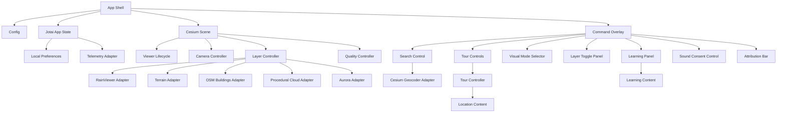

# MyEarth Detailed Design Document

## 1. Scope

This document is the authoritative detailed design for MyEarth, derived from `proposal.md`.

MyEarth is a routing-free React, TypeScript, Vite, CesiumJS single-page application that presents a cinematic 3D Earth for portfolio and educational use. The implementation must prioritize natural wonders and Earth-science learning, keep major cities secondary, run on normal consumer laptops, deploy to Vercel, and preserve practical WCAG AA accessibility and privacy-friendly behavior.

This design is decision complete. Implementers should not choose alternate libraries, data sources, UI modes, state tools, or service strategies unless the requirements are formally changed.

## 2. Selected Implementation Defaults

- UI framework: React with TypeScript.
- Build tool: Vite.
- Globe engine: CesiumJS.
- Styling: CSS Modules, with shared CSS custom properties in `tokens.css`.
- State management: Jotai.
- Unit tests: Vitest.
- Component tests: React Testing Library.
- Browser and visual QA: Playwright.
- Deployment: Vercel.
- Telemetry: typed no-op adapter by default; anonymous events only if explicitly configured.
- Clouds: lightweight procedural overlay in v1.
- Night lights: Cesium ion Earth at Night / NASA Black Marble imagery layer.
- Time behavior: live-time day/night shading only; no manual time UI in v1.
- Search: Cesium ion geocoding.
- Weather radar: RainViewer Weather Maps API.
- 3D buildings: Cesium OSM Buildings, loaded opportunistically for cities.
- Educational source policy: internal source notes required for learning content; citations are not shown in the main UI by default.
- City shortcuts: New York City, Tokyo, London, Paris, Dubai, San Francisco, Singapore.

## 3. Non-Goals

The first production version does not include:

- User accounts.
- Payments.
- Admin dashboards.
- Collaborative classroom features.
- Native mobile apps.
- Offline globe data.
- Commercial weather licensing.
- Real-time aurora API integration.
- User-generated content uploads.
- Manual date/time controls.
- React Router or multi-page navigation.

## 4. Architecture Overview

Cesium owns all globe rendering. React owns UI composition, command dispatch, accessibility controls, and app state. Jotai stores serializable app state only; Cesium objects stay inside controller modules.



## 5. Source Layout

Use this project structure unless an implementation constraint requires a direct equivalent.

```text
src/
  app/
    App.tsx
    appAtoms.ts
    appActions.ts
    AppErrorBoundary.tsx
  config/
    env.ts
    constants.ts
  cesium/
    CesiumScene.tsx
    createViewer.ts
    viewerLifecycle.ts
    cesiumTypes.ts
  camera/
    cameraController.ts
    cameraPresets.ts
    cameraTypes.ts
  content/
    locations.ts
    learningContent.ts
    sourceNotes.ts
    contentTypes.ts
    validateContent.ts
  layers/
    layerController.ts
    layerDefinitions.ts
    visualModes.ts
    terrainLayer.ts
    buildingsLayer.ts
    nightLightsLayer.ts
    weatherRadarLayer.ts
    proceduralCloudLayer.ts
    auroraLayer.ts
    labelLayer.ts
  search/
    searchService.ts
    cesiumGeocoderAdapter.ts
  tour/
    tourController.ts
    tourTypes.ts
  sound/
    soundscape.ts
    soundTypes.ts
  performance/
    qualityController.ts
    frameHealthMonitor.ts
    deviceProfile.ts
  telemetry/
    telemetry.ts
    telemetryTypes.ts
  persistence/
    preferences.ts
  accessibility/
    reducedMotion.ts
    liveRegion.ts
    focusManagement.ts
  ui/
    CommandOverlay.tsx
    GlobeLoadingScreen.tsx
    SearchControl.tsx
    VisualModeSelector.tsx
    LayerTogglePanel.tsx
    TourControls.tsx
    LocationList.tsx
    LearningPanel.tsx
    SoundConsentControl.tsx
    AttributionBar.tsx
    QualityIndicator.tsx
    ErrorFallback.tsx
  styles/
    globals.css
    tokens.css
```

CSS Modules are used for component styles, for example `CommandOverlay.module.css`. `globals.css` is limited to reset, base typography, Cesium container sizing, and global focus defaults. `tokens.css` defines color, spacing, z-index, motion, and panel variables.

## 6. Shared Domain Types

Shared types must be small, explicit, and imported by modules that need them.

```ts
export type CameraMode =
  | "introOrbit"
  | "idleOrbit"
  | "manual"
  | "flyingToWonder"
  | "flyingToCity"
  | "tour"
  | "resetting";

export type VisualModeId =
  | "satellite"
  | "political"
  | "nightLights"
  | "terrainEmphasis"
  | "cleanGlobe";

export type LayerId =
  | "clouds"
  | "atmosphere"
  | "terrain"
  | "labels"
  | "buildings"
  | "weatherRadar"
  | "aurora"
  | "sound";

export type QualityMode = "auto" | "high" | "balanced" | "low";

export type LoadingPhase =
  | "boot"
  | "config"
  | "cesiumAssets"
  | "viewer"
  | "firstFrame"
  | "ready"
  | "failed";

export type LayerAvailability =
  | { status: "available" }
  | { status: "disabled"; reason: string }
  | { status: "failed"; reason: string; recoverable: boolean };

export type AppError = {
  code:
    | "missing-cesium-token"
    | "webgl-unavailable"
    | "cesium-init-failed"
    | "terrain-failed"
    | "layer-failed"
    | "weather-unavailable"
    | "search-failed"
    | "sound-unavailable";
  severity: "info" | "warning" | "fatal";
  publicMessage: string;
  recoverable: boolean;
};
```

## 7. Configuration Module

### Responsibility

The configuration module parses Vite environment variables into a typed client-safe configuration.

### Owns

- `VITE_CESIUM_ION_TOKEN`.
- Optional telemetry flags.
- App environment classification.
- Safe public configuration validation.

### Does Not Own

- Fetching Cesium assets.
- Token creation or rotation.
- Vercel dashboard operations.

### Interface

```ts
export type AppConfig = {
  cesiumIonToken?: string;
  appEnv: "development" | "preview" | "production";
  telemetry: {
    enabled: boolean;
    endpoint?: string;
  };
};

export function readAppConfig(env: ImportMetaEnv): AppConfig;
```

### Behavior

- Missing `VITE_CESIUM_ION_TOKEN` returns a config without a token and does not throw.
- Unsupported `VITE_APP_ENV` values fall back to `development`.
- `VITE_TELEMETRY_ENABLED` must be exactly `true` to enable telemetry.
- `VITE_TELEMETRY_ENDPOINT` is ignored unless telemetry is enabled.
- The Cesium token is never logged.

### Failure Behavior

- Invalid optional telemetry endpoint disables telemetry and emits a non-fatal configuration warning.
- Missing token results in the missing-token fallback state during viewer initialization.

### Independent Tests

- Parses a valid token.
- Handles missing token.
- Disables telemetry by default.
- Enables telemetry only with explicit flag and endpoint.
- Never includes token value in thrown messages or public errors.

## 8. Jotai App State Module

### Responsibility

The Jotai app state module stores serializable UI and domain state. It does not store Cesium viewer instances, primitives, imagery layers, or Web Audio nodes.

### Atoms

```ts
export const loadingPhaseAtom = atom<LoadingPhase>("boot");
export const cameraModeAtom = atom<CameraMode>("introOrbit");
export const selectedLocationIdAtom = atom<string | undefined>(undefined);
export const visualModeAtom = atom<VisualModeId>("satellite");
export const qualityModeAtom = atom<QualityMode>("auto");
export const effectiveQualityAtom = atom<QualityProfile>(defaultQualityProfile);

export const layerVisibilityAtom = atom<Record<LayerId, boolean>>({
  clouds: true,
  atmosphere: true,
  terrain: true,
  labels: true,
  buildings: false,
  weatherRadar: false,
  aurora: false,
  sound: false,
});

export const layerAvailabilityAtom = atom<Record<LayerId, LayerAvailability>>(
  defaultLayerAvailability
);

export const tourStateAtom = atom<TourState>({
  status: "idle",
  currentIndex: 0,
});

export const soundStateAtom = atom<SoundState>({ status: "notPrompted" });

export const weatherStateAtom = atom<{
  status: "idle" | "loading" | "ready" | "failed";
  latestFrameTime?: number;
}>({ status: "idle" });

export const accessibilityAtom = atom({
  reducedMotion: false,
  reducedUi: false,
});
```

### Behavior

- Atoms are updated through action helpers in `appActions.ts`.
- Components subscribe to only the atoms they render.
- Controller modules receive commands and callbacks, not direct atom setters, except at app orchestration boundaries.
- Static location and learning content are imported data, not atom state.

### Failure Behavior

- Invalid persisted values are ignored and replaced with defaults.
- Controller failures update typed error or availability atoms without crashing the React tree.

### Independent Tests

- Defaults match first-load requirements.
- Layer visibility updates do not mutate unrelated layers.
- Invalid location selection is rejected by action helper.
- No atom type can hold a Cesium object.

## 9. App Shell Module

### Responsibility

`App` initializes configuration, preferences, reduced-motion state, quality mode, viewer lifecycle, and the command overlay.

### Owns

- Top-level app composition.
- Error boundary.
- Loading and fatal fallback routing inside the single page.
- Dependency wiring between Jotai state, controllers, UI, preferences, and telemetry.

### Does Not Own

- Cesium API calls.
- Weather metadata parsing.
- Camera math.
- Sound synthesis internals.

### Flow

1. Read app config.
2. Load local preferences.
3. Initialize reduced-motion state.
4. Compute initial quality profile.
5. Render `GlobeLoadingScreen`.
6. Mount `CesiumScene`.
7. Receive viewer-ready callback.
8. Receive first-nonblank-frame callback.
9. Start intro orbit unless reduced motion disables it.
10. Fade in `CommandOverlay`.
11. Make sound prompt eligible after the first user interaction.

### Failure Behavior

- Fatal Cesium or WebGL failure renders `ErrorFallback`.
- Missing Cesium token renders limited setup fallback with clear Vercel env guidance.
- Optional layer failures appear in the overlay and never unmount the globe.

### Independent Tests

- Shows loading before first frame.
- Shows overlay after first frame.
- Shows missing-token fallback with no token value.
- Applies persisted visual mode and quality mode.
- Does not instantiate controllers more than once per viewer lifecycle.

## 10. Cesium Scene Module

### Responsibility

`CesiumScene` is the React boundary around the Cesium container. It creates the container element, delegates viewer creation, attaches controllers, and reports lifecycle events.

### Owns

- Cesium DOM container.
- Viewer creation and teardown delegation.
- Pointer, wheel, and touch listeners used to pause orbit.
- First-frame detection.
- Controller initialization.

### Does Not Own

- Overlay UI.
- Static content.
- Search input.
- Web Audio.

### Props

```ts
export type CesiumSceneProps = {
  config: AppConfig;
  visualMode: VisualModeId;
  layers: Record<LayerId, boolean>;
  qualityMode: QualityMode;
  selectedLocationId?: string;
  cameraCommand?: CameraCommand;
  onViewerReady: () => void;
  onFirstFrame: () => void;
  onCameraModeChange: (mode: CameraMode) => void;
  onLayerAvailabilityChange: (id: LayerId, availability: LayerAvailability) => void;
  onError: (error: AppError) => void;
};
```

### Behavior

- Creates the viewer once for a mounted container.
- Applies visual mode and layer changes through `LayerController`.
- Applies camera commands through `CameraController`.
- Detects a first useful frame after the initial camera preset and one successful render.
- Pauses orbit on drag, wheel, pinch, and keyboard-driven manual camera actions.
- Keeps the Cesium credit display visible or routes it to `AttributionBar`.

### Failure Behavior

- Viewer creation failure becomes a fatal `AppError`.
- Controller setup failure becomes fatal only if it prevents core globe rendering.
- Optional controller failure updates layer availability and sends anonymous telemetry category.

### Independent Tests

- Viewer is created once.
- Viewer is not recreated for layer toggle changes.
- Viewer is not recreated for visual mode changes.
- Viewer is destroyed on unmount.
- First-frame callback fires once.
- User pointer event emits manual camera mode.

## 11. Viewer Lifecycle Module

### Responsibility

The viewer lifecycle module encapsulates Cesium construction, token assignment, WebGL checks, base imagery, terrain setup, and cleanup.

### Interface

```ts
export type ViewerCreateOptions = {
  token?: string;
  container: HTMLElement;
  initialQuality: QualityProfile;
};

export type ViewerCreateResult =
  | { status: "ready"; viewer: Cesium.Viewer }
  | { status: "missingToken"; message: string }
  | { status: "failed"; error: AppError };

export async function createMyEarthViewer(
  options: ViewerCreateOptions
): Promise<ViewerCreateResult>;

export function destroyMyEarthViewer(viewer: Cesium.Viewer): void;
```

### Behavior

- Assigns `Cesium.Ion.defaultAccessToken` only when a token exists.
- Uses Cesium imagery and terrain providers compatible with the selected token.
- Disables default Cesium UI widgets that duplicate custom UI, except required credits.
- Enables lighting and sun position behavior for live-time day/night shading.
- Uses request-render mode only if camera transitions, orbit, and dynamic overlays remain smooth.

### Failure Behavior

- Missing token returns `missingToken`.
- WebGL unavailable returns fatal `webgl-unavailable`.
- Cesium constructor failure returns fatal `cesium-init-failed`.
- Terrain provider failure after viewer creation reports `terrain-failed` through layer availability, not as viewer failure.

### Independent Tests

- Missing token result is non-throwing.
- WebGL failure maps to fatal app error.
- Destroy is idempotent.
- Cesium default widgets are configured as specified.
- Token value is never included in public errors.

## 12. Camera Controller Module

### Responsibility

The camera controller centralizes all camera behavior: intro orbit, idle orbit, fly-to, reset, search destinations, tour destinations, reduced-motion behavior, and user interruption.

### Owns

- Camera state machine.
- Camera command execution.
- Orbit animation loop.
- Cesium camera API calls.
- Reduced-motion transition scaling.

### Does Not Own

- Location content validation.
- Tour sequencing.
- UI controls.

### Interface

```ts
export type CameraCommand =
  | { type: "startIntroOrbit" }
  | { type: "startIdleOrbit" }
  | { type: "pauseOrbit"; reason: "user" | "tour" | "system" }
  | { type: "flyToLocation"; locationId: string; source: "wonder" | "city" | "search" }
  | { type: "flyToCoordinates"; latitude: number; longitude: number; heightMeters?: number }
  | { type: "resetView" };

export type CameraController = {
  execute(command: CameraCommand): Promise<void>;
  notifyManualInteraction(): void;
  getMode(): CameraMode;
  dispose(): void;
};
```

### State Machine

```text
introOrbit -> idleOrbit
introOrbit -> manual
idleOrbit -> manual
idleOrbit -> flyingToWonder
idleOrbit -> flyingToCity
idleOrbit -> tour
manual -> idleOrbit
manual -> flyingToWonder
manual -> flyingToCity
manual -> resetting
flyingToWonder -> idleOrbit
flyingToCity -> idleOrbit
tour -> flyingToWonder
tour -> flyingToCity
tour -> idleOrbit
resetting -> idleOrbit
```

### Behavior

- Initial camera uses the global cinematic preset.
- Reset uses the global reset preset, not Cesium defaults.
- Wonder fly-to uses wonder camera presets.
- City fly-to uses city camera presets and may request buildings.
- Search result fly-to uses result coordinates and a safe default height.
- User drag, wheel, pinch, or touch camera input pauses orbit and enters `manual`.
- Reduced motion shortens transition duration, removes decorative roll, and disables continuous idle orbit by default.

### Failure Behavior

- Unknown location id rejects with typed error and leaves camera mode unchanged.
- Interrupted flight resolves cleanly and enters `manual`.
- Cesium camera API failure reports recoverable runtime error unless the viewer is unusable.

### Independent Tests

- Manual interaction pauses orbit.
- Reset uses reset preset.
- Wonder fly-to uses wonder preset.
- City fly-to requests building descent opportunity.
- Reduced motion applies duration scale.
- Unknown location id fails safely.

## 13. Camera Presets Module

### Responsibility

Camera presets store named, validated camera positions and transition durations.

### Interface

```ts
export type CameraPreset = {
  id: string;
  target: {
    latitude: number;
    longitude: number;
    heightMeters?: number;
  };
  destinationHeightMeters: number;
  orientation: {
    headingDegrees: number;
    pitchDegrees: number;
    rollDegrees: number;
  };
  durationSeconds: {
    default: number;
    reducedMotion: number;
  };
};
```

### Required Presets

- `initial-global`
- `reset-global`
- One preset for each required wonder.
- One preset for each selected city.
- A generic search-result preset fallback.

### Validation Rules

- Latitude is between -90 and 90.
- Longitude is between -180 and 180.
- Heights are finite positive numbers.
- Reduced-motion duration is less than or equal to default duration.
- Pitch and heading values are finite.

### Independent Tests

- Every required location references an existing preset.
- Every preset validates.
- Reset and initial presets are distinct.
- Search fallback preset exists.

## 14. Location Content Module

### Responsibility

The location content module defines all curated wonders and city shortcuts as static typed data.

### Interface

```ts
export type LearningTopic =
  | "terrain"
  | "climate"
  | "ecosystems"
  | "atmosphere"
  | "water"
  | "ice"
  | "human-impact"
  | "urbanization"
  | "geology"
  | "biodiversity";

export type EarthLocation = {
  id: string;
  name: string;
  kind: "wonder" | "city";
  category: string;
  coordinates: {
    latitude: number;
    longitude: number;
    heightMeters?: number;
  };
  cameraPresetId: string;
  summary: string;
  facts: string[];
  topics: LearningTopic[];
  suggestedLayers: LayerId[];
  sourceNoteIds: string[];
  buildingDescentPreferred: boolean;
};
```

### Required Wonders

- Mount Everest.
- Grand Canyon.
- Amazon Rainforest.
- Great Barrier Reef.
- Sahara Desert.
- Antarctica.
- Himalayas.
- Aurora region.

### Required City Shortcuts

- New York City.
- Tokyo.
- London.
- Paris.
- Dubai.
- San Francisco.
- Singapore.

### Behavior

- Wonders sort before cities in the UI.
- The primary tour uses exactly the eight wonders.
- City records are secondary and set `buildingDescentPreferred` to true.
- Each wonder has at least three facts.
- Each content record has internal source notes for factual claims.

### Failure Behavior

- Content validation failure fails tests and build-time validation.
- Runtime lookup of an unknown location returns a typed not-found result.

### Independent Tests

- Required wonder ids exist exactly once.
- Required city ids exist exactly once.
- Wonders have at least three facts.
- All coordinates are valid.
- All camera preset references exist.
- All source note ids exist.

## 15. Educational Source Notes Module

### Responsibility

Source notes track factual basis for educational copy without showing citations in the main learning panel UI.

### Interface

```ts
export type SourceNote = {
  id: string;
  title: string;
  publisher: string;
  url: string;
  accessedPurpose: "terrain" | "climate" | "ecosystems" | "water" | "ice" | "human-impact" | "urbanization" | "general";
};
```

### Behavior

- Every learning topic and location fact references one or more source notes.
- Source notes can be shown in developer documentation or an optional credits/details view.
- The main learning panel does not display inline citations by default.
- Copy must avoid precise claims that are not supported by source notes.

### Failure Behavior

- Missing source note reference fails content validation.
- Empty URL or publisher fails content validation.

### Independent Tests

- Every source note has title, publisher, and URL.
- Every source note id is unique.
- Every source reference resolves.
- Every required topic has at least one source note.

## 16. Learning Content Module

### Responsibility

Learning content provides Earth-science panels for selected locations and general topics.

### Interface

```ts
export type LearningPanelContent = {
  id: string;
  locationId?: string;
  topicIds: LearningTopic[];
  title: string;
  summary: string;
  sections: Array<{
    heading: string;
    body: string;
  }>;
  suggestedLayerActions: Array<{
    layerId: LayerId;
    label: string;
  }>;
  sourceNoteIds: string[];
};
```

### Required Topics

- Terrain and plate tectonics.
- Climate systems.
- Ecosystems and biomes.
- Atmosphere and weather.
- Water cycle and oceans.
- Ice, polar systems, and sea level.
- Human impact.
- Night lights and urbanization.

### Behavior

- Selecting a wonder opens location-specific learning content.
- Selecting a city shows a shorter secondary panel focused on urbanization, night lights, or buildings.
- Suggested layer actions dispatch layer toggle commands.
- Aurora content states that the aurora layer is illustrative.
- Text is concise enough for mobile panels but richer than trivia.

### Failure Behavior

- Missing selected-location content falls back to a general topic panel.
- Invalid suggested layer id fails content validation.

### Independent Tests

- Every required topic exists.
- Every required wonder has learning panel content.
- Suggested layer ids are valid.
- Every content block has source notes.
- Aurora content contains illustrative disclaimer.

## 17. Visual Mode Module

### Responsibility

The visual mode module defines mutually exclusive globe presentation modes and how each maps to imagery, labels, terrain emphasis, night lights, and radar opacity.

### Interface

```ts
export type VisualModeDefinition = {
  id: VisualModeId;
  label: string;
  description: string;
  imageryStrategy: "satellite" | "political" | "nightLights" | "clean";
  labelsDefault: boolean;
  terrainEmphasis: boolean;
  nightLightsEnabled: boolean;
  preferredRadarOpacity: number;
  disabledLayerDefaults: LayerId[];
};
```

### Required Modes

- Satellite.
- Political/labeled.
- Night lights.
- Terrain emphasis.
- Clean globe.

### Behavior

- Exactly one primary visual mode is active.
- Mode changes do not recreate the Cesium viewer.
- Satellite mode uses standard Cesium ion imagery.
- Political/labeled mode prioritizes labels.
- Night lights mode enables the Cesium ion Earth at Night / NASA Black Marble imagery layer.
- Terrain emphasis keeps terrain on and adjusts visual presentation for relief legibility.
- Clean globe hides nonessential overlays and labels.

### Failure Behavior

- If night-lights imagery fails, the mode remains selected but marks night lights unavailable and falls back to satellite imagery with a non-blocking warning.
- If labels fail, political mode remains usable without labels and reports the failure.

### Independent Tests

- All five modes exist.
- Only one active mode can be set.
- Night lights mode enables night-lights layer.
- Clean globe disables clutter layers.
- Radar opacity is between 0 and 1.

## 18. Layer Controller Module

### Responsibility

The layer controller owns all Cesium visual layers and exposes a uniform adapter contract. Sound appears in the layer toggle UI but is controlled by the sound module.

### Interface

```ts
export type CesiumLayerAdapter = {
  id: LayerId;
  initialize(viewer: Cesium.Viewer): Promise<LayerAvailability>;
  setEnabled(enabled: boolean): Promise<LayerAvailability>;
  applyQualityProfile?(profile: QualityProfile): Promise<void>;
  dispose(): void;
};

export type LayerController = {
  setVisualMode(mode: VisualModeId): Promise<void>;
  setLayerEnabled(id: LayerId, enabled: boolean): Promise<LayerAvailability>;
  getLayerAvailability(id: LayerId): LayerAvailability;
  applyQualityProfile(profile: QualityProfile): Promise<void>;
  dispose(): void;
};
```

### Controlled Layers

- Atmosphere.
- Terrain.
- Labels.
- Buildings.
- Weather radar.
- Procedural clouds.
- Aurora.
- Night lights as an internal imagery layer used by visual mode.

### Behavior

- Initializes required baseline layers first: atmosphere, terrain when available, satellite imagery.
- Initializes expensive optional layers lazily.
- Keeps layer failures isolated.
- Applies quality fallback in the required order.
- Updates `layerAvailabilityAtom` after every layer state change.

### Failure Behavior

- Optional layer failure never fails the app.
- Required baseline imagery failure escalates to viewer fallback only if no usable globe can render.
- Failed recoverable layers can be retried by toggling off and on.

### Independent Tests

- Toggling one layer does not affect unrelated layers.
- Failed optional adapter returns failed availability.
- Quality profile disables layers in documented order.
- Visual mode change does not recreate viewer.

## 19. Terrain Layer Module

### Responsibility

Terrain provides relief for mountains, canyons, polar regions, and city descents.

### Inputs And Outputs

- Input: Cesium viewer, Cesium ion token availability, quality profile.
- Output: terrain provider state and layer availability.

### Behavior

- Uses Cesium ion terrain when token and asset access are available.
- Falls back to ellipsoid terrain when terrain fails.
- Terrain toggle switches between terrain provider and ellipsoid fallback where practical.
- Terrain emphasis mode adjusts globe presentation without introducing unsupported scientific exaggeration claims.

### Failure Behavior

- Terrain load failure marks terrain as failed but keeps imagery, camera, and UI usable.
- Missing token disables terrain with setup guidance.

### Independent Tests

- Terrain provider initializes with token.
- Terrain failure falls back to ellipsoid.
- Terrain toggle changes availability state.
- Terrain failure does not block camera commands.

## 20. Buildings Layer Module

### Responsibility

The buildings module loads Cesium OSM Buildings for secondary city descents.

### Behavior

- Loads lazily when the buildings toggle is enabled or a city shortcut requests buildings.
- Does not load during first cinematic render.
- Uses Cesium OSM Buildings where available.
- Keeps OpenStreetMap attribution visible through Cesium credits or `AttributionBar`.
- Is disabled before terrain detail is reduced during performance fallback.

### Failure Behavior

- Failure marks buildings as failed and recoverable.
- City fly-to still completes without buildings.
- Missing token disables buildings with setup guidance.

### Independent Tests

- Buildings load lazily.
- City fly-to can request buildings.
- Buildings failure does not stop city camera transition.
- Attribution state updates when buildings are enabled.

## 21. Night Lights Layer Module

### Responsibility

The night lights module manages the Cesium ion Earth at Night / NASA Black Marble imagery layer used by night lights mode and educational urbanization content.

### Behavior

- Creates the night-lights imagery provider through Cesium ion imagery.
- Adds the imagery layer only when night lights mode is active or the implementation needs a blended night-side effect.
- Uses layer alpha and brightness tuned for readability.
- Does not replace live-time sun lighting; it complements the visual mode.

### Failure Behavior

- Failure falls back to satellite mode imagery while keeping the selected mode state and showing a recoverable warning.
- Missing token disables the layer.

### Independent Tests

- Night lights mode requests the imagery layer.
- Layer can be removed or hidden without recreating viewer.
- Missing token disables night lights.
- Failure does not affect other imagery layers.

## 22. Procedural Cloud Layer Module

### Responsibility

The cloud layer provides optional lightweight cloud visuals without external data dependencies.

### Behavior

- Uses a procedural transparent overlay or generated texture managed inside the app.
- Does not fetch external cloud imagery.
- Animates subtly only when performance profile allows.
- Is disabled or simplified early in fallback.
- Does not block first frame.

### Failure Behavior

- Cloud initialization failure disables clouds and reports a recoverable layer error.
- Low quality sets clouds to simple or off.

### Independent Tests

- Cloud layer initializes without network.
- Cloud toggle affects only clouds.
- Low quality disables or simplifies clouds.
- Cloud failure does not block globe rendering.

## 23. Aurora Layer Module

### Responsibility

The aurora layer provides an illustrative polar educational effect.

### Behavior

- Renders near polar regions.
- Uses no external aurora API in v1.
- Marks aurora as illustrative in learning content.
- Is disabled or simplified in low quality.
- Does not obscure controls, labels, or attribution.

### Failure Behavior

- Failure disables aurora only.
- Reduced-motion may use static aurora instead of animated shimmer.

### Independent Tests

- Aurora toggles independently.
- Low quality disables or simplifies aurora.
- Reduced motion avoids distracting animation.
- Learning content includes illustrative disclaimer.

## 24. Weather Radar Module

### Responsibility

The weather module wraps RainViewer metadata fetching, caching, tile URL construction, and Cesium imagery provider creation.

### Interface

```ts
export type RadarFrame = {
  time: number;
  path: string;
};

export type RadarMetadata = {
  generated: number;
  host: string;
  frames: RadarFrame[];
};

export type WeatherRadarService = {
  fetchMetadata(signal?: AbortSignal): Promise<RadarMetadata>;
  getLatestFrame(signal?: AbortSignal): Promise<RadarFrame | undefined>;
  createImageryProvider(frame: RadarFrame): Cesium.ImageryProvider;
};
```

### Behavior

- Fetches `https://api.rainviewer.com/public/weather-maps.json`.
- Uses the latest available `radar.past` frame by default.
- Caches successful metadata for 10 minutes.
- Builds tile URLs from returned `host` and frame `path`.
- Uses maximum zoom level 7.
- Uses tile size 512 by default and 256 in low quality.
- Uses opacity between 0.45 and 0.7 based on visual mode and quality profile.
- Shows RainViewer attribution when active.

### Failure Behavior

- Network failure marks weather radar unavailable and shows a non-blocking message.
- Invalid metadata marks weather radar failed and recoverable.
- Empty frame list disables radar until next refresh.
- Weather failure never blocks app readiness.

### Independent Tests

- Parses valid metadata.
- Rejects invalid metadata safely.
- Selects latest frame.
- Builds expected tile URL template.
- Enforces maximum zoom 7.
- Uses 10-minute cache.
- Failure updates weather state without throwing through UI.

## 25. Search Module

### Responsibility

Search handles query input, Cesium ion geocoding, result display, and selected-result camera commands.

### Interface

```ts
export type SearchResult = {
  id: string;
  label: string;
  destination: {
    latitude: number;
    longitude: number;
    heightMeters?: number;
  };
};

export type SearchService = {
  search(query: string, signal?: AbortSignal): Promise<SearchResult[]>;
};
```

### Behavior

- Uses Cesium ion geocoding.
- Debounces query input.
- Cancels or ignores stale requests.
- Does not persist search query text.
- Does not send search query text to telemetry.
- Selecting a result emits a camera command rather than directly touching Cesium from the UI.

### Failure Behavior

- Empty query returns no results and does not call geocoder.
- Failed query shows a short non-blocking status.
- Missing token disables search with setup guidance.

### Independent Tests

- Empty query does not call service.
- Debounced input calls service once.
- Stale request is ignored.
- Failed query announces error.
- Selected result emits camera command.

## 26. Tour Module

### Responsibility

The tour module sequences the eight required natural wonders and coordinates selected location, camera commands, and learning panel updates.

### Interface

```ts
export type TourState = {
  status: "idle" | "playing" | "paused" | "complete";
  currentLocationId?: string;
  currentIndex: number;
};

export type TourController = {
  start(): void;
  pause(): void;
  resume(): void;
  next(): void;
  previous(): void;
  stop(): void;
};
```

### Behavior

- Primary tour contains exactly the eight wonders.
- Cities are not part of the primary tour.
- Start selects Mount Everest unless content order is formally changed.
- Next advances through the configured wonder list.
- Previous moves back one wonder.
- Stop clears tour mode and leaves the selected location visible.
- Manual camera interaction pauses the tour.
- Reduced motion keeps tour controls but shortens flights.

### Failure Behavior

- Missing location content fails validation before runtime.
- Camera command failure pauses tour and shows recoverable status.

### Independent Tests

- Tour includes exactly the eight wonders.
- Start selects first wonder.
- Next and previous update index correctly.
- Manual camera interaction pauses tour.
- Stop returns status to idle.

## 27. Sound Module

### Responsibility

The sound module owns Web Audio API consent, synthesis, playback, volume, preference persistence, and unavailable-browser behavior.

### Interface

```ts
export type SoundState =
  | { status: "notPrompted" }
  | { status: "promptVisible" }
  | { status: "enabled"; volume: number }
  | { status: "disabled" }
  | { status: "unavailable"; reason: string };

export type Soundscape = {
  prompt(): void;
  enable(): Promise<SoundState>;
  disable(): Promise<SoundState>;
  setVolume(volume: number): void;
  dispose(): void;
};
```

### Behavior

- Sound is off by default.
- No audio context starts before explicit user interaction.
- Prompt appears only after the app is usable and user interaction is eligible.
- Uses subtle generated Web Audio tones, not external audio files.
- Visible controls allow enable, disable, and volume adjustment.
- Stores only sound preference locally.

### Failure Behavior

- Browser blocks Web Audio: sound becomes unavailable with reason.
- Audio context failure does not affect globe or UI.

### Independent Tests

- No audio starts on page load.
- Enable requires user action.
- Disable suspends or stops audio.
- Preference persists locally.
- Unavailable browser shows disabled state.

## 28. Performance And Quality Module

### Responsibility

The performance module selects initial quality, monitors frame health, and applies fallback while preserving globe readability and interaction smoothness.

### Interface

```ts
export type QualityProfile = {
  mode: QualityMode;
  effectiveTier: "high" | "balanced" | "low";
  starDensity: "high" | "medium" | "low";
  cinematicGlow: "full" | "reduced" | "minimal";
  clouds: "full" | "simple" | "off";
  aurora: "full" | "simple" | "off";
  radar: "full" | "reducedOpacity" | "off";
  buildings: "on" | "off";
  terrainDetail: "normal" | "reduced";
  transitionScale: number;
};
```

### Inputs

- User quality mode.
- Device memory when available.
- Hardware concurrency when available.
- Mobile/touch context.
- WebGL capability.
- Runtime frame timing.
- Reduced-motion state.

### Fallback Order

1. Reduce cinematic extras such as dense stars, glow intensity, and transition duration.
2. Disable or simplify procedural clouds.
3. Disable aurora effects.
4. Lower radar opacity or disable radar.
5. Disable 3D buildings.
6. Lower terrain detail if needed.
7. Preserve globe quality and interaction smoothness.

### Behavior

- `auto` computes effective quality and may downgrade after sustained poor frame timing.
- `high`, `balanced`, and `low` are explicit user selections.
- Runtime downgrade uses hysteresis to avoid flicker.
- Quality changes are reflected in `QualityIndicator`.
- Reduced motion applies transition scaling independently of quality tier.

### Failure Behavior

- Missing device APIs use conservative balanced defaults.
- Frame monitor failure disables automatic downgrade and leaves user quality controls available.

### Independent Tests

- Device profile maps to expected tier.
- Fallback order is deterministic.
- User low setting disables expensive overlays.
- Hysteresis prevents rapid tier flipping.
- Reduced motion modifies transition scale.

## 29. Command Overlay UI Module

### Responsibility

The command overlay composes all controls over the globe without owning Cesium behavior.

### Owns

- Top app/title cluster.
- Search control.
- Wonder tour control.
- Visual mode selector.
- Layer toggle panel.
- Learning panel.
- Location quick list.
- Reset button.
- Quality status.
- Attribution bar placement.
- Sound consent control placement.

### Does Not Own

- Cesium viewer.
- Camera API calls.
- Weather fetches.
- Sound synthesis internals.

### Behavior

- Fades or slides in after first frame.
- Desktop layout keeps controls compact and leaves center globe visible.
- Tablet layout reduces panel width and allows collapsible side panels.
- Mobile layout uses compact top and bottom controls with collapsible panels.
- Uses CSS Modules and shared CSS tokens.
- Avoids nested cards and marketing-style sections.
- Keeps Cesium and service attribution visible.

### Failure Behavior

- If viewer is not ready, controls render disabled states.
- If layer unavailable, toggle shows disabled reason.
- If learning content fallback is used, panel indicates general topic content.

### Independent Tests

- Required controls render.
- Overlay renders with disabled state before viewer ready.
- Reset button emits reset command.
- Mobile layout avoids simultaneous expanded side panels.
- Controls do not cover attribution in viewport tests.

## 30. Search Control Component

### Responsibility

Provide accessible global search UI.

### Behavior

- Input has visible or accessible label.
- Results are keyboard navigable.
- Enter selects active result.
- Escape closes results.
- Loading, empty, and error states are announced through live region.
- Search text is cleared or left local only after result selection; it is never persisted.

### Independent Tests

- Input has accessible name.
- Arrow keys move active option.
- Enter emits selected result.
- Escape closes listbox.
- Search failure announces status.

## 31. Visual Mode Selector Component

### Responsibility

Provide mutually exclusive selection among the five visual modes.

### Behavior

- Uses segmented control or tabs.
- Exactly one mode is active.
- Active state is visible and exposed through ARIA.
- Keyboard navigation changes selection.
- Labels are short: Satellite, Labels, Night, Terrain, Clean.

### Independent Tests

- Renders all modes.
- Selecting a mode emits mode id.
- Active mode has accessible selected state.
- Keyboard navigation works.

## 32. Layer Toggle Panel Component

### Responsibility

Provide independent toggles for clouds, atmosphere, terrain, labels, buildings, weather radar, aurora, and sound.

### Behavior

- Uses buttons or switches with accessible pressed/checked state.
- Shows unavailable reason for disabled layers.
- Delegates sound toggle to sound module.
- Weather disabled state explains RainViewer unavailability.
- Buildings disabled state explains token, fallback, or performance state.

### Independent Tests

- All required toggles render.
- Toggle emits correct layer id.
- Disabled reason appears.
- Sound toggle emits sound action separately from Cesium layer action.

## 33. Learning Panel Component

### Responsibility

Display selected location education and general Earth-science content.

### Behavior

- Shows selected wonder summary, facts, topics, and suggested layer actions.
- Shows shorter city learning content for secondary city shortcuts.
- Collapsible on mobile.
- Focus moves to panel when opened by keyboard action.
- Does not trap focus because it is a panel, not a modal.
- Does not show inline citations by default.

### Independent Tests

- Renders selected wonder content.
- Renders city content.
- Suggested layer action emits layer command.
- Collapse state remains accessible.
- Keyboard-open action moves focus to panel.

## 34. Location List Component

### Responsibility

Provide quick access to wonders and secondary city shortcuts.

### Behavior

- Wonders render first and receive primary visual hierarchy.
- City shortcuts render second with secondary hierarchy.
- Selecting a wonder emits selected location and wonder fly-to command.
- Selecting a city emits selected location, city fly-to command, and opportunistic buildings request.

### Independent Tests

- Eight wonders render.
- Seven cities render.
- Wonders appear before cities.
- City selection does not require buildings success.
- Selection emits correct location id.

## 35. Accessibility Module

### Responsibility

Accessibility helpers provide reduced-motion detection, live region announcements, focus management, and reusable accessible control patterns.

### Interface

```ts
export function useReducedMotion(): boolean;
export function announceStatus(message: string): void;
export function moveFocusToPanel(panelId: string): void;
```

### Behavior

- All icon-only controls have accessible names.
- All toggles expose state.
- All primary workflows are keyboard reachable.
- Loading, selected location, search failure, and layer failure states are announced.
- Reduced motion affects camera, UI entrance, aurora, and cloud animation.
- Semantic controls provide alternatives for core canvas interactions: search, tour, reset, location list, and layer toggles.

### Failure Behavior

- If focus target is unavailable, focus remains unchanged and status is announced.
- If media query API is unavailable, reduced motion defaults to false.

### Independent Tests

- Reduced-motion hook responds to media query.
- Live region receives status messages.
- Icon buttons have accessible names.
- Focus management moves focus when target exists.
- Keyboard path reaches all primary controls.

## 36. Persistence Module

### Responsibility

Persist only allowed local browser preferences.

### Allowed Keys

```text
myearth.soundPreference
myearth.qualityMode
myearth.visualMode
myearth.reducedUi
```

### Interface

```ts
export type PreferencesStore = {
  load(): UserPreferences;
  save(next: UserPreferences): void;
  clear(): void;
};

export type UserPreferences = {
  soundPreference?: "enabled" | "disabled";
  qualityMode?: QualityMode;
  visualMode?: VisualModeId;
  reducedUi?: boolean;
};
```

### Behavior

- Validates stored enum values before applying them.
- Ignores corrupt local storage values.
- Does not store search queries.
- Does not store precise user location.
- Does not store telemetry identifiers.

### Failure Behavior

- Local storage unavailable: preferences silently fall back to defaults.
- Invalid JSON: ignore and continue.

### Independent Tests

- Saves and loads allowed preferences.
- Rejects invalid values.
- Handles unavailable local storage.
- Provides no API for disallowed data.

## 37. Telemetry Module

### Responsibility

Telemetry provides a typed adapter for anonymous performance and error categories. The default implementation is no-op.

### Interface

```ts
export type TelemetryEvent =
  | { type: "app_load_timing"; bucket: string }
  | { type: "cesium_init_failure"; category: string }
  | { type: "layer_load_failure"; layerId: LayerId; category: string }
  | { type: "runtime_error"; category: string }
  | { type: "frame_health"; bucket: "good" | "fair" | "poor" }
  | { type: "browser_capability"; bucket: string };

export type TelemetryClient = {
  track(event: TelemetryEvent): void;
};
```

### Behavior

- No-op by default.
- Sends events only when config explicitly enables telemetry and supplies an endpoint.
- Sends only typed categories and buckets.
- Does not send search query text, precise location, names, emails, accounts, raw IP-derived location, or persistent cross-site identifiers.
- Does not send full stack traces.

### Failure Behavior

- Telemetry network failure is swallowed.
- Invalid telemetry config disables telemetry.

### Independent Tests

- Default client is no-op.
- Disabled telemetry sends nothing.
- Typed API cannot include disallowed fields.
- Telemetry failure does not affect app behavior.

## 38. Attribution Module

### Responsibility

The attribution module keeps Cesium, OpenStreetMap, RainViewer, NASA Black Marble, and imagery credits visible where required.

### Behavior

- Preserves Cesium credit display or mounts it inside `AttributionBar`.
- Shows OpenStreetMap attribution when OSM Buildings are active.
- Shows RainViewer attribution when radar is active.
- Shows NASA Black Marble / Cesium ion attribution according to Cesium credit behavior when night lights are active.
- Stays visible on mobile and desktop.
- Is not hidden during intro orbit.

### Failure Behavior

- If custom attribution bar fails to mount, Cesium default credit container remains visible.

### Independent Tests

- Attribution bar renders.
- RainViewer attribution appears when radar active.
- OpenStreetMap attribution appears when buildings active.
- Attribution remains visible in viewport tests.

## 39. Error And Fallback Module

### Responsibility

Provide clear user-facing fallback states for fatal and recoverable failures.

### Behavior

- Fatal WebGL or Cesium initialization failure renders `ErrorFallback`.
- Missing token renders setup guidance for `VITE_CESIUM_ION_TOKEN`.
- Optional layer failure shows inline non-blocking status.
- Search failure shows non-blocking status.
- Sound failure disables sound only.
- Public messages never expose token values or raw stack traces.

### Independent Tests

- WebGL failure renders fatal fallback.
- Missing token message is safe.
- Weather failure leaves globe visible.
- Layer retry can clear recoverable error.
- Error messages are announced to assistive technology.

## 40. First-Load Flow

1. Browser loads the Vite app.
2. `App` parses configuration and preferences.
3. `GlobeLoadingScreen` appears with concise status text.
4. `CesiumScene` mounts the globe container.
5. Viewer lifecycle checks token and WebGL support.
6. Cesium viewer initializes with atmosphere, lighting, and base imagery.
7. Initial global camera preset is applied.
8. First nonblank frame is detected.
9. Loading phase becomes `ready`.
10. Intro orbit starts unless reduced motion disables it.
11. Command overlay fades in.
12. Sound prompt becomes eligible after the first user interaction.

## 41. Core User Flows

### Wonder Tour

1. User starts tour.
2. Tour selects Mount Everest.
3. Camera controller enters tour/fly-to state.
4. Learning panel shows Mount Everest content.
5. User advances through Grand Canyon, Amazon Rainforest, Great Barrier Reef, Sahara Desert, Antarctica, Himalayas, and Aurora region.
6. Manual camera movement pauses the tour.

### City Shortcut

1. User selects a secondary city.
2. Camera controller flies to city preset.
3. Buildings layer is requested if available and not disabled by quality fallback.
4. City learning panel opens.
5. If buildings fail, city view remains usable.

### Search

1. User types query.
2. Search control debounces.
3. Cesium geocoder adapter returns results.
4. User selects result.
5. Camera flies to result coordinates.
6. Query is not persisted or sent to telemetry.

### Weather Radar

1. User enables radar.
2. Weather service fetches RainViewer metadata.
3. Latest radar frame creates Cesium imagery layer.
4. RainViewer attribution appears.
5. Failure disables radar with non-blocking status.

## 42. Deployment Design

### Vercel Configuration

Required environment variable:

```text
VITE_CESIUM_ION_TOKEN=<dedicated production token>
```

Optional environment variables:

```text
VITE_APP_ENV=production
VITE_TELEMETRY_ENABLED=false
VITE_TELEMETRY_ENDPOINT=
```

### Token Requirements

- Use a dedicated Cesium ion token for MyEarth.
- Do not use the account default token in production.
- Minimum public scopes expected: `assets:read` and `geocode`.
- Restrict allowed URLs to the production Vercel domain and any configured custom domain.
- Document local development token setup.

### Commands

```text
npm install
npm run typecheck
npm run lint
npm run build
npm run preview
```

If implementation scripts differ, README must document the exact equivalents.

## 43. Test Strategy

### Unit Tests With Vitest

- Config parsing.
- Jotai action helpers.
- Content validation.
- Source note validation.
- Camera preset validation.
- Tour sequencing.
- Search service behavior with mocked adapter.
- RainViewer metadata parsing and cache.
- Quality profile computation.
- Persistence validation.
- Telemetry no-op behavior.
- Accessibility helper functions.

### Component Tests With React Testing Library

- Search control keyboard behavior.
- Visual mode selector.
- Layer toggle panel.
- Tour controls.
- Location list ordering.
- Learning panel content and collapse.
- Sound consent control.
- Error fallback.
- Attribution bar.

### Browser Tests With Playwright

- Nonblank Cesium canvas after first load.
- Intro orbit starts after ready state.
- Manual drag pauses orbit.
- Reset view works.
- Search result selection triggers fly-to.
- Wonder tour advances through all required wonders.
- City shortcut requests buildings without requiring success.
- Visual modes switch without viewer recreation.
- Layer toggles update visible state.
- Sound does not start before opt-in.
- RainViewer failure is non-blocking.
- Desktop, tablet, and mobile layouts have no overlapping controls.

### Visual QA

Capture screenshots for:

- Loading state.
- First cinematic globe.
- Satellite mode.
- Night lights mode.
- Terrain emphasis mode.
- Weather radar enabled.
- Learning panel open.
- Mobile collapsed panel.
- Low quality fallback.

## 44. Acceptance Mapping

| Requirement | Design Coverage |
| --- | --- |
| React + TypeScript + Vite | Selected defaults, source layout, deployment |
| CesiumJS globe engine | Viewer lifecycle, Cesium scene, layer controller |
| Cinematic first load | First-load flow, camera controller, command overlay |
| Natural wonders first | Location content, tour, location list |
| Cities secondary | Location content, buildings layer, city flow |
| Earth-science panels | Learning content, source notes, learning panel |
| Visual modes | Visual mode module, night lights layer |
| Layer toggles | Layer controller, toggle panel |
| RainViewer weather | Weather radar module, attribution |
| Sound opt-in | Sound module, sound consent control |
| Performance fallback | Quality module, layer controller |
| WCAG AA practical access | Accessibility module, UI components |
| Privacy-friendly telemetry | Telemetry, persistence |
| Vercel deployment | Deployment design |
| Independent testability | Per-module tests, test strategy |

