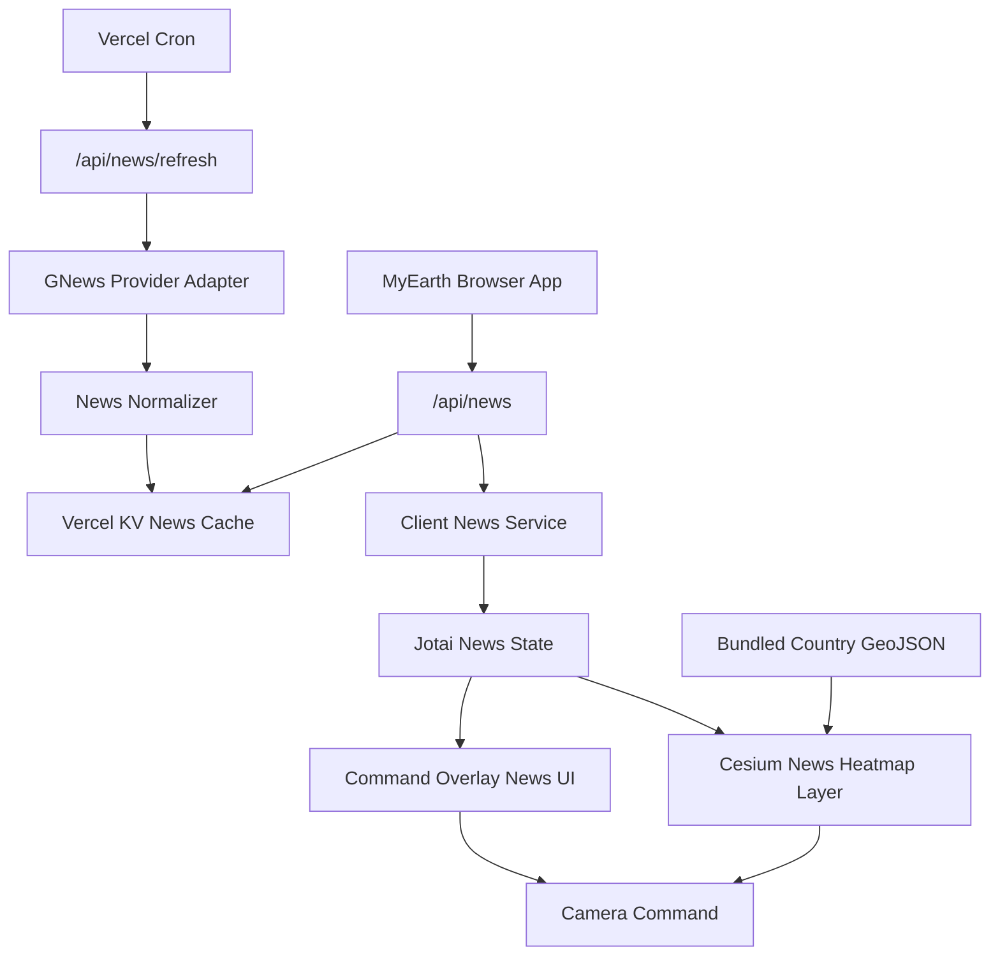

# MyEarth Global News Heatmap Detailed Design

## 1. Scope

This document is the authoritative detailed design for the MyEarth global news heatmap feature, derived from `proposal_news.md`.

The feature adds a country-level live-news visualization to the existing React, TypeScript, Vite, CesiumJS, CSS Modules, Jotai, Vitest, Playwright, and Vercel application. It must keep MyEarth map-first, compact, and usable when news data is missing or delayed.

This document is requirements and design only. It does not implement code. Implementers should not choose alternate providers, cache storage, backend runtime, UI modes, or data refresh behavior unless `proposal_news.md` is formally changed.

## 2. Selected Implementation Defaults

- News provider: GNews Top Headlines.
- Provider query: `country=<countryCode>`, `category=general`, `lang=en`, `max=10`.
- Provider usage model: personal/demo, free tier only.
- Refresh cadence: daily.
- Backend runtime: Vercel Function.
- Durable cache: Vercel KV.
- Refresh trigger: Vercel Cron.
- Browser API entrypoint: `/api/news`.
- Cron refresh entrypoint: `/api/news/refresh`.
- API key env var: `GNEWS_API_KEY`.
- Optional cron guard env var: `NEWS_REFRESH_SECRET`.
- Map granularity: country level.
- Boundary data: bundled simplified GeoJSON country polygons.
- Heatmap metric: headline volume per country.
- Default visibility: news heatmap off.
- Article media: provider image URLs may be displayed when GNews supplies them.
- Article content: title, short summary, source, publish time, and external link only.

## 3. Non-Goals

- No full news reader.
- No infinite feed.
- No paid API requirement.
- No browser-side GNews calls.
- No article body scraping.
- No graphic media.
- No individual story geocoding in v1.
- No user accounts, personalization, saved stories, or notifications.
- No separate backend service outside Vercel.

## 4. Architecture Overview

News is split into independent server, data, state, Cesium, and UI modules.



Server modules own provider access and quota protection. Client modules own user state, map visualization, and UI rendering. Cesium objects remain inside Cesium-specific modules and never enter Jotai state.

## 5. Source Layout

Use this project structure unless implementation constraints require a direct equivalent.

```text
api/
  news.ts
  news/
    refresh.ts

src/
  news/
    newsTypes.ts
    newsCountries.ts
    newsNormalizer.ts
    newsClient.ts
    gnewsProvider.ts
    newsCache.ts
    countryBoundaries.ts
  app/
    appAtoms.ts
    appActions.ts
  cesium/
    CesiumScene.tsx
  layers/
    newsHeatmapLayer.ts
    layerController.ts
  ui/
    NewsPanel.tsx
    NewsPanel.module.css
    CommandOverlay.tsx
    LayerTogglePanel.tsx
    AttributionBar.tsx
```

Server-only modules may live under `api/` or a `src/news/server/` helper directory imported only by Vercel Functions. Browser bundles must not import server-only modules that read `GNEWS_API_KEY` or Vercel KV credentials.

## 6. Shared News Domain Types

### Responsibility

Define serializable news types shared by server normalizers, client services, app state, UI, and tests.

### Interface

```ts
export type NewsProviderId = "GNews";

export type NewsArticle = {
  id: string;
  title: string;
  summary: string;
  url: string;
  sourceName: string;
  publishedAt: string;
};

export type NewsCountrySummary = {
  countryCode: string;
  countryName: string;
  headlineCount: number;
  articles: NewsArticle[];
};

export type NewsSnapshot = {
  provider: NewsProviderId;
  category: "general";
  language: "en";
  lastUpdated: string;
  countries: Record<string, NewsCountrySummary>;
};

export type NewsUnavailableReason =
  | "missing-api-key"
  | "quota-exceeded"
  | "provider-failed"
  | "cache-empty"
  | "invalid-provider-payload";

export type NewsApiResponse =
  | {
      status: "ready";
      snapshot: NewsSnapshot;
      stale: boolean;
      message?: string;
    }
  | {
      status: "unavailable";
      reason: NewsUnavailableReason;
      message: string;
    };

export type NewsState =
  | { status: "idle" }
  | { status: "loading" }
  | { status: "ready"; snapshot: NewsSnapshot; selectedCountryCode?: string }
  | { status: "unavailable"; reason: NewsUnavailableReason; message: string };
```

### Behavior

- All timestamps are ISO 8601 strings.
- Country codes are lower-case ISO-style provider country codes.
- `headlineCount` is the count used for heatmap intensity and equals the normalized article count for that country.
- `articles` contains at most 10 items per country.
- Article `summary` is provider-supplied description/content summary only, not scraped article body.

### Independent Tests

- News types remain serializable.
- Ready and unavailable API responses are accepted by type guards.
- Invalid timestamp or malformed country code fixtures fail normalization tests.

## 7. Country Metadata And Boundaries Module

### Responsibility

Own the supported country list, country display names, map centroids, camera heights, and bundled simplified GeoJSON boundaries.

### Owns

- `newsCountries.ts` for metadata.
- `countryBoundaries.ts` or imported simplified GeoJSON.
- Mapping from GNews country code to boundary feature.

### Interface

```ts
export type NewsCountryDefinition = {
  code: string;
  name: string;
  centroid: {
    latitude: number;
    longitude: number;
  };
  cameraHeightMeters: number;
};

export type NewsCountryBoundary = {
  countryCode: string;
  polygons: Array<Array<[longitude: number, latitude: number]>>;
};

export function getNewsCountry(code: string): NewsCountryDefinition | undefined;
export function getNewsCountryBoundary(
  code: string
): NewsCountryBoundary | undefined;
export function listNewsCountries(): readonly NewsCountryDefinition[];
```

### Behavior

- V1 targets documented GNews country codes that also have bundled country boundary data.
- Countries with no supported boundary are omitted from the heatmap and treated as no-data.
- Boundary data is simplified enough for browser performance but recognizable at globe scale.
- Country metadata does not depend on network access.

### Failure Behavior

- Missing boundary for a supported country is non-fatal.
- Invalid boundary data fails tests and should not ship.

### Independent Tests

- Every listed country has a unique code and display name.
- Every heatmap-enabled country has at least one valid polygon.
- Coordinates stay within latitude and longitude ranges.
- Camera centroids stay within valid ranges.

## 8. GNews Provider Adapter Module

### Responsibility

Fetch per-country GNews top headlines from the server side.

### Owns

- GNews URL construction.
- Provider request timeout.
- Provider HTTP status handling.
- Conversion from country list to provider calls.

### Interface

```ts
export type GNewsProviderOptions = {
  apiKey: string;
  fetcher?: typeof fetch;
  timeoutMs?: number;
};

export type GNewsCountryRequest = {
  countryCode: string;
  category: "general";
  language: "en";
  max: 10;
};

export type GNewsProvider = {
  fetchTopHeadlines(
    request: GNewsCountryRequest,
    signal?: AbortSignal
  ): Promise<unknown>;
};
```

### Behavior

- Uses `https://gnews.io/api/v4/top-headlines`.
- Sends query params: `country`, `category=general`, `lang=en`, `max=10`, `apikey`.
- Does not expose the API key in logs, errors, client responses, or browser code.
- Treats HTTP 401/403 as configuration failure.
- Treats HTTP 429 as quota exceeded.
- Treats non-2xx responses as provider failure unless specifically mapped.

### Failure Behavior

- Missing `GNEWS_API_KEY` is detected before provider calls.
- Timeouts abort the country request and mark the refresh as failed.
- Provider failure for one country does not corrupt the last successful cached snapshot.

### Independent Tests

- Constructs the correct GNews URL without logging the key.
- Maps 429 to `quota-exceeded`.
- Maps invalid JSON to `invalid-provider-payload`.
- Aborts on timeout.

## 9. News Normalizer Module

### Responsibility

Convert provider payloads into the stable MyEarth news snapshot shape.

### Interface

```ts
export function normalizeGNewsCountryResponse(input: {
  countryCode: string;
  countryName: string;
  payload: unknown;
  nowIso: string;
}): NewsCountrySummary;

export function createNewsSnapshot(input: {
  countries: NewsCountrySummary[];
  lastUpdated: string;
}): NewsSnapshot;
```

### Behavior

- Reads only provider article fields needed for v1.
- Generates stable article ids from country code, URL or title, and index.
- Trims whitespace from titles, summaries, source names, and URLs.
- Drops articles without title or URL.
- Normalizes safe HTTP(S) provider image URLs into `imageUrl`.
- Keeps at most 10 valid articles per country.
- Sets `headlineCount` to valid article count.

### Failure Behavior

- Empty provider result returns a country summary with zero headlines.
- Invalid provider root shape throws `invalid-provider-payload`.
- Invalid single article entries are skipped if other valid articles exist.

### Independent Tests

- Normalizes valid GNews fixtures.
- Drops articles with missing title or URL.
- Preserves source name and published timestamp.
- Returns zero headlines for empty article arrays.
- Throws on invalid root payload.

## 10. News Cache Repository Module

### Responsibility

Store and read durable news snapshots and refresh metadata in Vercel KV.

### Owns

- KV keys.
- Snapshot TTL policy.
- Refresh lock.
- Stale-cache fallback.

### Interface

```ts
export type NewsCacheRecord = {
  snapshot: NewsSnapshot;
  refreshedAt: string;
};

export type NewsRefreshMetadata = {
  status: "idle" | "refreshing" | "failed";
  lastAttemptAt?: string;
  lastSuccessAt?: string;
  lastFailureReason?: NewsUnavailableReason;
};

export type NewsCacheRepository = {
  getSnapshot(): Promise<NewsCacheRecord | undefined>;
  setSnapshot(record: NewsCacheRecord): Promise<void>;
  getMetadata(): Promise<NewsRefreshMetadata>;
  setMetadata(metadata: NewsRefreshMetadata): Promise<void>;
  acquireRefreshLock(nowIso: string): Promise<boolean>;
  releaseRefreshLock(): Promise<void>;
};
```

### KV Keys

- `myearth:news:snapshot:active`
- `myearth:news:metadata`
- `myearth:news:refresh-lock`

### Behavior

- Active snapshot persists for at least 48 hours so stale fallback is possible after one failed daily refresh.
- The refresh lock prevents concurrent cron/request refreshes from spending duplicate quota.
- Cache reads never call GNews.
- Cache writes happen only after a valid full or partial snapshot is created.

### Failure Behavior

- KV read failure returns an unavailable API response if no in-memory fallback exists.
- KV write failure returns failure from refresh endpoint but does not delete the prior snapshot.
- Lock acquisition failure exits refresh without provider calls.

### Independent Tests

- Cache hit returns snapshot.
- Cache miss returns undefined.
- Lock prevents duplicate refresh.
- Failed write preserves previous record.
- Metadata records last failure reason.

## 11. News Refresh Service Module

### Responsibility

Coordinate daily refresh across all supported countries while respecting the free-tier request budget.

### Interface

```ts
export type NewsRefreshResult =
  | { status: "refreshed"; snapshot: NewsSnapshot; countryCount: number }
  | { status: "skipped"; reason: "locked" | "fresh-cache" }
  | { status: "failed"; reason: NewsUnavailableReason; message: string };

export async function refreshNewsSnapshot(options: {
  provider: GNewsProvider;
  cache: NewsCacheRepository;
  countries: readonly NewsCountryDefinition[];
  now: () => Date;
}): Promise<NewsRefreshResult>;
```

### Behavior

- Runs at most once per calendar day unless manually forced by a protected server path.
- Iterates the supported GNews country list.
- Makes one provider request per country.
- Uses `max=10`.
- Builds one snapshot containing every successfully normalized country.
- Empty countries are included with zero headline count.
- Countries that fail during refresh are omitted from the new snapshot only if the overall refresh still has enough valid countries to be useful.
- Writes a new active snapshot only after normalization succeeds.

### Failure Behavior

- If all provider calls fail, keep the existing cached snapshot and mark refresh failed.
- If quota is exceeded, stop further provider calls, keep existing cache, and record `quota-exceeded`.
- If no API key exists, do not acquire lock or call provider.

### Independent Tests

- Refresh calls provider once per configured country.
- Refresh stops on quota exceeded.
- Empty country responses still produce valid summaries.
- All-country provider failure does not overwrite cache.
- Successful refresh updates snapshot and metadata.

## 12. News API Handler Module

### Responsibility

Serve normalized news data to the browser without exposing provider credentials.

### Endpoints

```text
GET /api/news
GET /api/news/refresh
```

### `GET /api/news`

- Reads the active snapshot from KV.
- Returns `status: "ready"` when a snapshot exists.
- Sets `stale: true` if the snapshot is older than 24 hours.
- Does not call GNews.
- Returns unavailable when no snapshot exists or cache access fails.

### `GET /api/news/refresh`

- Intended for Vercel Cron.
- Optionally validates `NEWS_REFRESH_SECRET` when configured.
- Calls the refresh service.
- Returns refresh result and never includes `GNEWS_API_KEY`.

### Failure Behavior

- Missing key returns unavailable or failed refresh with setup-safe wording.
- Quota failure returns unavailable only if there is no cached snapshot.
- Existing stale cache is preferred over blank failure.

### Independent Tests

- `/api/news` returns cached ready response.
- `/api/news` does not call provider.
- `/api/news` returns unavailable on empty cache.
- `/api/news/refresh` rejects invalid secret when configured.
- Handler responses never contain API key values.

## 13. Client News Service Module

### Responsibility

Fetch `/api/news`, normalize API availability for the app, and isolate client UI from raw HTTP details.

### Interface

```ts
export type NewsClient = {
  loadSnapshot(signal?: AbortSignal): Promise<NewsApiResponse>;
};

export function createNewsClient(fetcher?: typeof fetch): NewsClient;
```

### Behavior

- Fetches `/api/news`.
- Parses JSON into `NewsApiResponse`.
- Does not retry automatically in v1.
- Supports `AbortSignal` so UI can cancel loads on unmount.
- Treats malformed API responses as unavailable.

### Failure Behavior

- Network failure returns `provider-failed` unavailable state.
- Abort rejects or resolves silently according to existing app service patterns.

### Independent Tests

- Fetches the correct endpoint.
- Parses ready response.
- Parses unavailable response.
- Converts invalid JSON to unavailable.
- Handles abort without setting stale UI state.

## 14. Jotai News State Module

### Responsibility

Store serializable news UI state and integrate news layer visibility with existing layer atoms.

### State

```ts
export const newsStateAtom = atom<NewsState>({ status: "idle" });
```

`LayerId` adds:

```ts
| "newsHeatmap"
```

Default layer visibility adds:

```ts
newsHeatmap: false
```

Default layer availability starts disabled until a snapshot exists:

```ts
newsHeatmap: {
  status: "disabled",
  reason: "News headlines have not loaded."
}
```

### Actions

```ts
export type SelectNewsCountryInput = {
  countryCode: string;
};

export const selectNewsCountryActionAtom = atom(
  null,
  (get, set, input: SelectNewsCountryInput) => NewsCountrySummary | undefined
);
```

### Behavior

- News state stores only serializable snapshot data and selected country code.
- Cesium entities, GeoJSON objects, and provider clients are not stored in Jotai.
- Enabling `newsHeatmap` does not imply data is ready; layer availability controls disabled UI.
- Selected country is cleared when a new snapshot no longer contains that country.

### Independent Tests

- Defaults are serializable.
- News heatmap is off by default.
- Selecting an unknown country is rejected.
- Updating news state does not mutate unrelated layer state.

## 15. App Shell Integration Module

### Responsibility

Wire news client, news state, command overlay props, Cesium scene props, and camera commands.

### Behavior

- Creates one `NewsClient` instance.
- Loads news snapshot when the app reaches ready state or when the News panel is opened, whichever comes first.
- On ready snapshot:
  - stores `NewsState.ready`;
  - marks `newsHeatmap` available if at least one country has headlines;
  - keeps `newsHeatmap` disabled if no countries have headlines.
- On unavailable response:
  - stores `NewsState.unavailable`;
  - marks `newsHeatmap` disabled with a short reason.
- On selected country:
  - sets selected country in news state;
  - emits a `flyToCoordinates` camera command using country centroid and camera height;
  - opens or focuses the News panel.

### Failure Behavior

- News load failure is non-fatal.
- Missing news data does not affect Cesium viewer lifecycle, radar, search, sound, distance measuring, or existing layers.

### Independent Tests

- App shell loads news through `NewsClient`.
- Unavailable news disables the layer.
- Selected country emits a fly-to command.
- News errors do not render `ErrorFallback`.

## 16. Cesium News Heatmap Layer Module

### Responsibility

Render country-level heatmap geometry on the globe and emit country selections.

### Interface

```ts
export type NewsHeatmapLayerInput = {
  visible: boolean;
  snapshot?: NewsSnapshot;
  selectedCountryCode?: string;
};

export type NewsCountryPick = {
  countryCode: string;
};
```

### Behavior

- Adds Cesium polygon or entity primitives for countries with `headlineCount > 0`.
- Uses bundled simplified GeoJSON boundaries.
- Computes fill alpha from headline count relative to the highest country count in the active snapshot.
- Uses a restrained heatmap color that remains readable over satellite imagery.
- Selected country uses a stronger outline or fill.
- Disabling the layer hides or removes only news entities.
- Re-enabling reuses current snapshot and does not fetch data.
- Country click/pick emits country code to the app shell.

### Failure Behavior

- Missing Cesium polygon APIs marks `newsHeatmap` failed and recoverable.
- Invalid boundary for one country skips that country.
- Heatmap failure does not affect other Cesium layers.

### Independent Tests

- Creates entities only for countries with headlines.
- Does not create entities for zero-headline countries.
- Removes or hides entities on disable.
- Emits selected country code on pick.
- Does not recreate the viewer when news data changes.

## 17. Layer Controller Integration

### Responsibility

Expose `newsHeatmap` through the existing layer visibility and availability contract.

### Behavior

- Adds `newsHeatmap` to `LayerId`.
- Adds a news heatmap adapter to the layer controller.
- `setLayerVisibility("newsHeatmap", true)` delegates to the news heatmap adapter.
- News heatmap does not participate in visual mode defaults.
- News heatmap is not automatically enabled by any visual mode.
- News heatmap is not disabled by weather radar or labels.

### Failure Behavior

- Missing data disables the layer with a reason.
- Adapter failure marks the layer failed and recoverable.

### Independent Tests

- Layer controller routes news visibility updates.
- Layer availability updates are published.
- Toggling news does not mutate radar, labels, terrain, or sound.

## 18. News Panel Component

### Responsibility

Render news availability, selected country headlines, timestamps, and external links.

### Props

```ts
export type NewsPanelProps = {
  state: NewsState;
  layerEnabled: boolean;
  disabled?: boolean;
  onLayerToggle: (visible: boolean) => void;
  onSelectCountry: (countryCode: string) => void;
};
```

### Behavior

- Shows a compact control to enable or disable the news heatmap.
- Shows loading state while news is loading.
- Shows unavailable reason when news is unavailable.
- Shows dataset last updated time when ready.
- Shows selected country headlines if a selected country exists.
- Shows a no-headlines message for selected countries with zero headlines.
- Shows a concise list of countries with headlines when no country is selected.
- Article links use `target="_blank"` and `rel="noreferrer"`.
- Renders provider article images when `imageUrl` is available.
- Renders a related YouTube search link for each article.

### Failure Behavior

- Missing selected country in current snapshot clears selection or shows no-data.
- Long titles and summaries wrap without overlapping controls.

### Independent Tests

- Renders unavailable state.
- Renders last updated timestamp.
- Renders selected country headlines.
- Renders safe external links.
- Renders image elements and YouTube links for article media.

## 19. Command Overlay UI Integration

### Responsibility

Add News as a discoverable left-side command overlay control.

### Behavior

- Adds a News button alongside Places, Search, Layers, and Distance.
- Button opens or closes `NewsPanel`.
- Button text reflects availability:
  - `News` when idle/ready.
  - `News unavailable` in disabled state when space allows.
- Opening News may trigger client snapshot load if it has not loaded.
- On mobile, News panel follows the same stacked panel behavior as existing controls.

### Failure Behavior

- If news is unavailable, panel opens with explanation rather than hiding the feature.
- News panel does not cover Cesium attribution.

### Independent Tests

- News button is visible when app is ready.
- News panel is closed by default.
- Opening News shows loading, ready, or unavailable state.
- Existing buttons still render and work.

## 20. Layer Toggle Panel Integration

### Responsibility

Expose News as a map layer toggle consistent with current layers.

### Behavior

- Adds visible label `News`.
- Uses `newsHeatmap` layer id.
- Toggle is disabled when news layer availability is disabled or failed.
- Disabled reason appears below the layer grid.
- Toggle does not call sound-specific handlers.

### Independent Tests

- News toggle appears in Layers.
- News toggle is off by default.
- Disabled reason appears when unavailable.
- Clicking enabled News toggles `newsHeatmap`.

## 21. Attribution Module Integration

### Responsibility

Show GNews/source attribution where news appears without changing existing attribution obligations.

### Behavior

- Attribution bar shows `GNews` when `newsHeatmap` is enabled and a ready snapshot exists.
- News panel shows each article source name.
- Existing Cesium, RainViewer, NASA Black Marble, and OpenStreetMap attribution behavior remains unchanged.

### Failure Behavior

- If attribution bar fails to render, the News panel still shows source names.

### Independent Tests

- GNews attribution appears when news layer is active.
- GNews attribution does not appear when news layer is off.
- Existing service attribution tests continue to pass.

## 22. Accessibility Module Integration

### Responsibility

Make the news feature usable without relying on canvas-only heatmap information.

### Behavior

- News button, layer toggle, country list, and article links are keyboard operable.
- News panel uses semantic heading and list structure.
- Loading and unavailable states are announced through existing live-region/status patterns.
- Country headline counts are available in HTML in the News panel.
- Heatmap country selection has an equivalent country list interaction.
- Focus moves to the News panel when a country is selected by keyboard or map click.

### Independent Tests

- Keyboard opens News panel.
- Country list selection works without canvas picking.
- News status messages are present in accessible text.
- Article links have accessible names.

## 23. Privacy And Security Design

### Responsibility

Keep provider credentials private and avoid collecting sensitive user data.

### Behavior

- `GNEWS_API_KEY` is read only in Vercel Functions.
- Browser responses never include provider keys.
- Server logs never include provider keys.
- News requests do not include user identity, precise user location, search text, or account data.
- Client telemetry, if enabled, may only report anonymous categories such as news unavailable reason or layer failure category.
- Article URLs are rendered as provider-supplied external links; no proxying of article pages in v1.

### Independent Tests

- API responses do not contain configured secret values.
- Telemetry type tests reject raw article URLs, search text, identity, and precise location.
- Client bundle does not import server-only key-reading modules.

## 24. Error And Fallback Design

### Responsibility

Handle news failures without affecting the rest of MyEarth.

### User-Facing States

- Missing key: `News needs GNEWS_API_KEY on the server.`
- Quota exceeded: `News is unavailable because the daily news quota was reached.`
- Provider failure: `News is temporarily unavailable.`
- Cache empty: `News has not loaded yet.`
- Empty country: `No current headlines are available for this country.`

### Behavior

- Ready stale cache is shown with `stale: true` and original `lastUpdated`.
- Unavailable news disables the heatmap layer.
- Failed news refresh never deletes the last successful snapshot.
- News failure does not block loading screen completion.

### Independent Tests

- Each unavailable reason maps to safe public text.
- Stale snapshot renders with timestamp.
- Refresh failure preserves previous cache.
- News failure does not call fatal error handler.

## 25. Deployment Design

### Vercel Configuration

Required environment variables:

```text
GNEWS_API_KEY=<server-only GNews API key>
KV_REST_API_URL=<Vercel KV URL>
KV_REST_API_TOKEN=<Vercel KV token>
NEWS_REFRESH_SECRET=<optional cron guard secret>
```

Existing MyEarth variables remain unchanged:

```text
VITE_CESIUM_ION_TOKEN=<Cesium ion token>
VITE_APP_ENV=production
VITE_TELEMETRY_ENABLED=false
VITE_TELEMETRY_ENDPOINT=
```

### Cron

Vercel Cron calls:

```text
GET /api/news/refresh
```

Recommended schedule:

```text
0 3 * * *
```

The exact hour is not user-facing. The implementation must keep daily refresh within the free-tier request budget.

### Failure Behavior

- Missing KV config makes news unavailable but does not break the app.
- Missing GNews key makes news unavailable but does not break the app.
- Cron failure is visible through cache metadata and unavailable/stale UI state.

## 26. Core User Flows

### First Load With No News Key

1. App boots normally.
2. News layer is off by default.
3. User opens News.
4. Client calls `/api/news`.
5. API returns unavailable `missing-api-key`.
6. News panel shows setup-safe unavailable message.
7. Globe, search, radar, distance, and sound remain usable.

### First Load With Cached News

1. App boots normally.
2. News layer is off by default.
3. User opens News.
4. Client loads cached snapshot from `/api/news`.
5. News panel shows last updated time and headline country list.
6. User enables News.
7. Globe renders country heatmap.

### Select Country From Heatmap

1. News snapshot is ready.
2. News heatmap is enabled.
3. User selects highlighted country on the globe.
4. Cesium layer emits country code.
5. App updates selected news country.
6. Camera flies to country centroid.
7. News panel opens and shows that country's 10 headlines.

### Daily Refresh

1. Vercel Cron calls `/api/news/refresh`.
2. Refresh endpoint validates optional secret.
3. Refresh service acquires KV lock.
4. Provider adapter fetches GNews top headlines by country.
5. Normalizer creates snapshot.
6. Cache repository writes active snapshot and metadata.
7. Refresh lock is released.

## 27. Test Strategy

### Unit Tests With Vitest

- News type guards and serialization.
- Country metadata and boundary validation.
- GNews URL construction and error mapping.
- Provider payload normalization.
- Snapshot aggregation.
- Cache repository hit, miss, lock, stale fallback, and failed write.
- Refresh service success, quota exceeded, missing key, and all-provider-failed behavior.
- Client news service ready, unavailable, malformed response, and network failure behavior.

### Component Tests With React Testing Library

- News button appears and panel is closed by default.
- News unavailable state renders safe text.
- News ready state renders timestamp and country list.
- Selected country renders 10 or fewer article rows.
- External links use safe attributes.
- Layer panel renders News toggle and disabled reason.
- Attribution bar renders GNews only when active.

### Cesium Tests

- News heatmap entities are created for countries with headlines.
- Zero-headline countries are skipped.
- Disabling layer removes or hides news entities.
- Country pick emits selected country code.
- News data updates do not recreate the Cesium viewer.

### Browser Tests With Playwright

- No-key deployment keeps app usable and shows News unavailable.
- News panel opens from the command overlay.
- News toggle starts off.
- Enabling News shows GNews attribution when data is ready.
- Controls and attribution remain visible on desktop and mobile viewports.

### Acceptance Commands

```bash
npm run typecheck
npm run lint
npm run test
npm run build
```

Manual acceptance:

- With no `GNEWS_API_KEY`, MyEarth works and News is unavailable.
- With valid `GNEWS_API_KEY` and KV config, cron refresh creates a cached snapshot.
- With cached snapshot, `/api/news` returns ready data without calling GNews.
- Selecting a highlighted country flies the camera and opens its headlines.

## 28. Requirements Traceability

| Requirement | Design Coverage |
| --- | --- |
| GNews top headlines by country | GNews Provider Adapter, News Refresh Service |
| Free tier only | Refresh cadence, Vercel Cron, quota-safe cache |
| Server-side proxy | News API Handler |
| API key not exposed | Privacy And Security Design |
| Daily cache | News Cache Repository |
| Country heatmap | Country Metadata, Cesium News Heatmap Layer |
| Off by default | Jotai News State, Layer Toggle Panel |
| News button and layer toggle | Command Overlay UI, Layer Toggle Panel |
| Fly to country and open panel | App Shell Integration, Core User Flows |
| Timestamps | News Panel, API shape |
| No graphic media | News Normalizer, News Panel |
| No-data countries | Country Metadata, Error And Fallback Design |
| Independent module tests | Test Strategy sections |

## 29. Implementation Order

1. Add news domain types, country metadata, and boundary validation tests.
2. Add GNews provider adapter and normalizer tests.
3. Add Vercel KV cache repository and refresh service tests.
4. Add `/api/news` and `/api/news/refresh` handlers.
5. Add client news service and Jotai news state.
6. Add News panel and command overlay integration.
7. Add `newsHeatmap` layer id and layer toggle integration.
8. Add Cesium news heatmap layer.
9. Add attribution, accessibility, and browser tests.
10. Run typecheck, lint, unit tests, build, and manual no-key/keyed checks.
